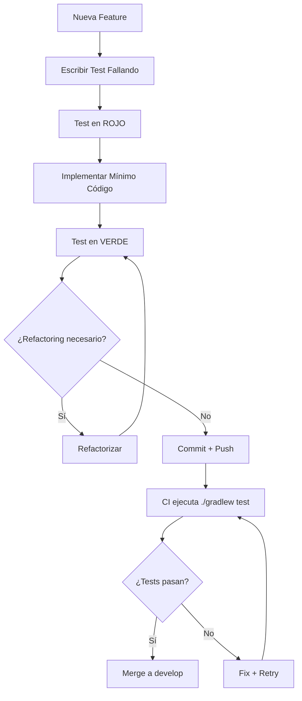

# 🎯 Estrategia de Testing — ms-factura

## Introducción

Este documento define la estrategia de Quality Assurance (QA) del microservicio **ms-factura**, estableciendo lineamientos claros sobre **qué, cómo y por qué** probamos. Diferencia explícitamente entre:

- **Verificación** *(Are we building the system right?)* — Validación técnica de que el código funciona correctamente
- **Validación** *(Are we building the right system?)* — Confirmación de que el sistema cumple las reglas de negocio esperadas

---

## 📐 Principios Fundamentales

### 1. Testing en Arquitectura Hexagonal

La arquitectura hexagonal del proyecto permite tests aislados por capa:

```
┌─────────────────────────────────────────────┐
│         INFRASTRUCTURE LAYER                │
│  ✓ Adaptadores de entrada (Kafka, RabbitMQ)│
│  ✓ Adaptadores de salida (File, Email)     │
│  → Tests verifican integración con frameworks│
└─────────────────────────────────────────────┘
                    ↓
┌─────────────────────────────────────────────┐
│         APPLICATION LAYER                   │
│  ✓ Servicios de aplicación                 │
│  ✓ Event Listeners                         │
│  → Tests validan orquestación y reglas     │
└─────────────────────────────────────────────┘
                    ↓
┌─────────────────────────────────────────────┐
│         DOMAIN LAYER                        │
│  ✓ Entidades de negocio                    │
│  ✓ Políticas de formato                    │
│  → Tests validan lógica de dominio puro    │
└─────────────────────────────────────────────┘
```

**Principio:** Los tests de capas superiores pueden usar mocks de capas inferiores, nunca al revés.

### 2. Pirámide de Testing Aplicada

```
       ╱╲
      ╱  ╲         E2E Tests (Manual / Futura fase)
     ╱────╲        - Validación de flujos completos
    ╱      ╲       
   ╱────────╲      Integration Tests (Futura fase)
  ╱          ╲     - TestContainers con Kafka/RabbitMQ/PostgreSQL
 ╱────────────╲    
╱   UNIT TESTS ╲   78 tests implementados
╲──────────────╱   - 100% cobertura de líneas
                   - 94.8% cobertura de branches
```

**Estado actual:** Excelente base de tests unitarios. Próxima fase: integración con contenedores.

---

## ✔️ Verificación vs. ✅ Validación

### Definiciones Operacionales

| Aspecto | Verificación | Validación |
|---------|--------------|------------|
| **Pregunta** | ¿El código funciona técnicamente? | ¿El sistema cumple las reglas de negocio? |
| **Enfoque** | Estructura, sintaxis, frameworks | Comportamiento funcional |
| **Ejemplo** | "¿Se invocó el método correcto?" | "¿El formato PDF se genera cuando formato='PDF'?" |
| **Herramientas** | `verify()`, `assertNotNull()`, estructura de clases | `assertEquals()`, `assertThat()`, flujos completos |
| **Audiencia** | Desarrolladores, arquitectos | Product Owners, stakeholders |

---

## 🔍 Matriz de Testing: Qué Probamos

### **CAPA DE DOMINIO** — Validación de Lógica de Negocio

#### ✅ **Validación**: Reglas de Negocio Puras

| Test Suite | Regla de Negocio Validada | Ubicación |
|------------|---------------------------|-----------|
| `FacturaTest` | • Constructor inicializa correctamente entidad Factura<br>• Setters/getters mantienen integridad de datos<br>• Valores por defecto son correctos | [FacturaTest.java](src/test/java/com/foodtech/ms_factura/domain/FacturaTest.java) |
| `ProductoTest` | • Constructor inicializa Producto con nombre, cantidad, precio<br>• Validación de atributos obligatorios<br>• Getters retornan valores exactos | [ProductoTest.java](src/test/java/com/foodtech/ms_factura/domain/ProductoTest.java) |
| `FacturaFormatoPolicyTest` | • **Regla:** Formato PDF se identifica correctamente<br>• **Regla:** Formato TXT se identifica correctamente<br>• **Regla:** Formato XLSX se identifica correctamente | [FacturaFormatoPolicyTest.java](src/test/java/com/foodtech/ms_factura/domain/FacturaFormatoPolicyTest.java) |
| `FoodEventTest` | • Evento de mensajería se deserializa correctamente<br>• Payload JSON se mapea a objeto Factura | [FoodEventTest.java](src/test/java/com/foodtech/ms_factura/domain/FoodEventTest.java) |

**Ejemplo concreto de Validación:**
```java
// Valida la regla de negocio: "El formato debe ser case-insensitive"
@Test
void shouldIdentifyPdfFormatCaseInsensitive() {
    Factura factura = new Factura();
    factura.setFormato("PdF");
    
    boolean isPdf = FacturaFormatoPolicy.isPdf(factura.getFormato());
    
    assertTrue(isPdf); // ✅ Validación de negocio
}
```

#### ✔️ **Verificación**: Estructura Técnica

- Constructor sin argumentos funciona (`assertNull(factura.getNombreCliente())`)
- @AllArgsConstructor inicializa todos los campos (Lombok)
- No hay nullPointers en getters/setters

---

### **CAPA DE APLICACIÓN** — Validación de Orquestación

#### ✅ **Validación**: Reglas de Proceso de Negocio

| Test Suite | Regla de Negocio Validada | Ubicación |
|------------|---------------------------|-----------|
| `GenerarFacturaServiceTest` | • **Regla:** Si `formato=TXT`, se invoca `TxtFacturaGeneratorPort`<br>• **Regla:** Si `formato=PDF`, se invoca `PdfFacturaGeneratorPort`<br>• **Regla:** Si `formato=XLSX`, se invoca `XlsxFacturaGeneratorPort`<br>• **Regla:** Cada generación publica evento `FacturaGeneradaEvent` | [GenerarFacturaServiceTest.java](src/test/java/com/foodtech/ms_factura/application/GenerarFacturaServiceTest.java) |
| `FacturaGeneradaEventListenerTest` | • **Regla:** No se envía notificación si email está vacío<br>• **Regla:** No se envía notificación si factura es null<br>• **Regla:** Se construye mensaje con template de asunto/cuerpo<br>• **Regla:** Se adjuntan archivos generados a la notificación | [FacturaGeneradaEventListenerTest.java](src/test/java/com/foodtech/ms_factura/application/notification/FacturaGeneradaEventListenerTest.java) |
| `NotificationDispatchServiceTest` | • **Regla:** Solo se envía notificación si `notificationEnabled=true`<br>• **Regla:** Se despacha al canal configurado (email, sms, etc.)<br>• **Regla:** Matching de canal es case-insensitive<br>• **Regla:** Si canal no soportado, no se envía nada | [NotificationDispatchServiceTest.java](src/test/java/com/foodtech/ms_factura/application/notification/NotificationDispatchServiceTest.java) |
| `NotificationConfigurationValidatorTest` | • **Regla:** Validación de configuración SMTP obligatoria<br>• **Regla:** Email "from" debe ser válido<br>• **Regla:** Host y puerto son obligatorios | [NotificationConfigurationValidatorTest.java](src/test/java/com/foodtech/ms_factura/application/notification/NotificationConfigurationValidatorTest.java) |

**Ejemplo concreto de Validación:**
```java
// Valida la regla de negocio crítica: "Selector de formato determina el generador usado"
@Test
void testGenerarFacturaPdf() {
    Factura factura = new Factura("Kelvin", productos, 15.0, "PDF");
    when(pdfFacturaGeneratorPort.generar(factura))
        .thenReturn(Path.of("/tmp/facturas/factura_test.pdf"));

    generarFacturaService.generarFactura(factura);

    verify(pdfFacturaGeneratorPort).generar(factura); // ✅ Validación
    verify(applicationEventPublisher).publishEvent(any(FacturaGeneradaEvent.class));
    verifyNoInteractions(txtFacturaGeneratorPort, xlsxFacturaGeneratorPort); // ✅ Validación crítica
}
```

#### ✔️ **Verificación**: Correctitud Técnica

- `@InjectMocks` inyecta dependencias correctamente
- Eventos de Spring se publican usando `ApplicationEventPublisher`
- `ArgumentCaptor` captura objetos complejos para inspección
- `ReflectionTestUtils` configura propiedades privadas en tests

---

### **CAPA DE INFRAESTRUCTURA** — Verificación de Integraciones

#### ✔️ **Verificación**: Frameworks y Adaptadores

| Test Suite | Aspecto Técnico Verificado | Ubicación |
|------------|----------------------------|-----------|
| `KafkaConsumerAdapterTest` | • Deserialización JSON de mensajes Kafka funciona<br>• Manejo de excepciones `JsonProcessingException`<br>• Invocación del use case con Factura mapeada<br>• Respuesta de confirmación se retorna | [KafkaConsumerAdapterTest.java](src/test/java/com/foodtech/ms_factura/infrastructure/adapters/input/kafka/KafkaConsumerAdapterTest.java) |
| `RabbitMqConsumerTest` | • Consumo de mensajes RabbitMQ funciona<br>• Mapeo de DTO a entidad de dominio<br>• Manejo de payloads string y objetos | [RabbitMqConsumerTest.java](src/test/java/com/foodtech/ms_factura/infrastructure/adapters/input/rabbitmq/RabbitMqConsumerTest.java) |
| `FilePdfFacturaGeneratorTest` | • iText genera PDF sin errores<br>• Archivo se crea en ruta configurada<br>• Contenido del PDF incluye datos de factura | [FilePdfFacturaGeneratorTest.java](src/test/java/com/foodtech/ms_factura/infrastructure/adapters/output/file/FilePdfFacturaGeneratorTest.java) |
| `FileTxtFacturaGeneratorTest` | • Archivo TXT se crea correctamente<br>• Formato de texto incluye productos<br>• Path retornado es correcto | [FileTxtFacturaGeneratorTest.java](src/test/java/com/foodtech/ms_factura/infrastructure/adapters/output/file/FileTxtFacturaGeneratorTest.java) |
| `FileXlsxFacturaGeneratorTest` | • Apache POI genera XLSX sin errores<br>• Celdas contienen datos correctos<br>• Formato de hoja es válido | [FileXlsxFacturaGeneratorTest.java](src/test/java/com/foodtech/ms_factura/infrastructure/adapters/output/file/FileXlsxFacturaGeneratorTest.java) |
| `EmailNotificationChannelTest` | • JavaMailSender crea MimeMessage<br>• Adjuntos se agregan correctamente<br>• Email "from" se configura si existe | [EmailNotificationChannelTest.java](src/test/java/com/foodtech/ms_factura/infrastructure/adapters/output/notification/EmailNotificationChannelTest.java) |

**Ejemplo concreto de Verificación:**
```java
// Verifica que el framework Kafka funciona técnicamente
@Test
void testConsumeJsonProcessingException() throws Exception {
    String invalidJson = "invalid json";

    String response = kafkaConsumer.consume(invalidJson);

    assertThat(response).contains("Error al procesar la factura"); // ✔️ Verificación
}
```

#### ✅ **Validación**: (En tests de infraestructura también hay validación)

- Test de EmailNotificationChannel valida que **si el "from" es null/blank, no se rompe** (regla de negocio: resilencia)
- Test de KafkaConsumer valida que **retorna mensaje de confirmación con nombre del cliente** (regla de trazabilidad)

---

### **TESTS ARQUITECTÓNICOS** — Verificación de Estructura

#### ✔️ **Verificación**: Cumplimiento de Principios Arquitectónicos

| Test Suite | Regla Arquitectónica Verificada | Ubicación |
|------------|----------------------------------|-----------|
| `LayeredArchitectureTest` | • **Domain** solo es accedido por Application e Infrastructure<br>• **Application** solo es accedido por Infrastructure<br>• **Infrastructure** no es accedido por ninguna capa<br>• **Domain** no depende de frameworks (Spring, Kafka, etc.) | [LayeredArchitectureTest.java](src/test/java/com/foodtech/ms_factura/architecture/LayeredArchitectureTest.java) |

**Ejemplo concreto:**
```java
@ArchTest
static final ArchRule domain_is_framework_agnostic = noClasses()
    .that().resideInAPackage("..domain..")
    .should().dependOnClassesThat().resideInAnyPackage(
        "org.springframework..",
        "jakarta..",
        "java.net.http.."
    ); // ✔️ Verificación de pureza del dominio
```

---

## 🧪 Estrategia de Testing por Tipo

### **1. Unit Tests** *(Estado actual: 78 tests)*

**Objetivo:** Probar cada componente de forma aislada usando mocks.

**Herramientas:**
- JUnit 5 (Jupiter)
- Mockito (@Mock, @Spy, @InjectMocks, ArgumentCaptor)
- AssertJ (fluent assertions)

**Cobertura exigida:**
- Mínimo 90% (configurado en `build.gradle`)
- Logrado: 100% líneas, 94.8% branches

**Qué NO cubre:**
- Integración real con Kafka/RabbitMQ
- Persistencia en PostgreSQL
- Envío real de emails

---

### **2. Integration Tests** *(Fase futura)*

**Objetivo:** Validar integración real con infraestructura externa.

**Plan propuesto:**
```java
@SpringBootTest
@Testcontainers
class FacturaIntegrationTest {
    
    @Container
    static KafkaContainer kafka = new KafkaContainer();
    
    @Container
    static PostgreSQLContainer postgres = new PostgreSQLContainer();
    
    @Test
    void shouldGenerateInvoiceFromKafkaMessage() {
        // Enviar mensaje real a Kafka
        // Esperar que archivo se genere en filesystem
        // Validar que registro se persiste en PostgreSQL
    }
}
```

**Herramientas planificadas:**
- Testcontainers (Kafka, PostgreSQL, RabbitMQ)
- @SpringBootTest con contexto completo

---

### **3. E2E Tests** *(Fase futura - manual/automatizada)*

**Objetivo:** Validar flujos de usuario completos.

**Escenario ejemplo:**
1. Cliente realiza pedido en sistema externo
2. Evento llega a Kafka
3. ms-factura genera factura PDF
4. Email se envía al cliente
5. Cliente recibe factura adjunta

**Herramienta propuesta:** Cucumber + Selenium (si hay UI) o Postman Collections

---

## 📊 Métricas de Calidad

### Métricas Actuales

| Métrica | Valor | Estado |
|---------|-------|--------|
| **Test Coverage (Lines)** | 100% | ✅ Excelente |
| **Test Coverage (Branches)** | 94.8% | ✅ Excelente |
| **Tests Totales** | 78 | ✅ Robusto |
| **Tests Fallidos** | 0 | ✅ Verde |
| **Tiempo de Ejecución** | ~34s | ✅ Rápido |
| **Automatización** | 100% | ✅ CI-ready |

### Comandos de Verificación

```bash
# Ejecutar todos los tests + coverage
./gradlew test

# Ver reporte HTML de cobertura
xdg-open build/reports/jacoco/test/html/index.html

# Verificar límite de cobertura (90% mínimo)
./gradlew jacocoTestCoverageVerification
```

---

## 🎯 Estrategia por Caso de Uso

### Caso 1: Nueva Feature — Agregar Formato CSV

**Verificación requerida:**
1. ✔️ Crear `CsvFacturaGeneratorPort` interface
2. ✔️ Implementar `FileCsvFacturaGenerator` adaptador
3. ✔️ Test: Archivo CSV se crea técnicamente sin errores
4. ✔️ Test: Path retornado es válido

**Validación requerida:**
5. ✅ Test en `GenerarFacturaServiceTest`: Si `formato=CSV`, se invoca `CsvFacturaGeneratorPort`
6. ✅ Test: Contenido CSV incluye todos los productos de la factura
7. ✅ Test: Formato CSV es parseable por Excel/LibreOffice
8. ✅ Test: Evento `FacturaGeneradaEvent` se publica con path del CSV

---

### Caso 2: Bugfix — Email no llega cuando "from" es null

**Pasos de testing:**
1. ✅ **Validar regla de negocio:** Escribir test que valide comportamiento esperado
   ```java
   @Test
   void shouldSendEmailEvenWhenFromIsNull() {
       // Test ya existe: EmailNotificationChannelTest
       // ✅ Valida que sistema es resiliente
   }
   ```

2. ✔️ **Verificar fix técnico:** Asegurar que no se lanza NullPointerException

3. ✅ **Regression test:** Ejecutar toda la suite para no romper nada

---

## 🚨 Tests Críticos (No Tocar Sin Justificación)

Los siguientes tests validan reglas de negocio críticas. Si fallan, NO deshabilitarlos; corregir el código:

1. **`GenerarFacturaServiceTest.testGenerarFactura[Txt|Pdf|Xlsx]`** → Selector de formato
2. **`NotificationDispatchServiceTest.shouldDispatchToConfiguredChannel`** → Routing de notificaciones
3. **`FacturaGeneradaEventListenerTest.shouldSkipDispatchWhenRecipientIsMissing`** → Protección ante datos inválidos
4. **`LayeredArchitectureTest.domain_is_framework_agnostic`** → Pureza de dominio

---

## 🔄 Proceso de Testing en el Flujo de Desarrollo

### Git Flow + TDD



### Definición de "Done"

Una tarea se considera **completa** cuando cumple:
- [ ] Tests unitarios escritos (coverage >= 90%)
- [ ] Tests en verde (0 fallos)
- [ ] Documentación actualizada (si aplica)
- [ ] Code review aprobado
- [ ] CI pipeline en verde

---

## 📚 Guía de Decisión: ¿Qué Tipo de Test Escribir?

### Flowchart de Decisión

```
¿Qué estás probando?
    │
    ├─ Lógica de negocio (cálculos, reglas)
    │   └─> Test UNITARIO en DOMAIN
    │       Tipo: ✅ VALIDACIÓN
    │
    ├─ Orquestación de servicios
    │   └─> Test UNITARIO en APPLICATION
    │       Tipo: ✅ VALIDACIÓN (reglas de proceso)
    │
    ├─ Integración con framework (Kafka, Spring)
    │   └─> Test UNITARIO en INFRASTRUCTURE
    │       Tipo: ✔️ VERIFICACIÓN (+ validación secundaria)
    │
    ├─ Flujo completo end-to-end
    │   └─> Test INTEGRACIÓN (fase futura)
    │       Tipo: ✅ VALIDACIÓN de negocio
    │
    └─ Arquitectura (capas, dependencias)
        └─> Test ARQUITECTÓNICO (ArchUnit)
            Tipo: ✔️ VERIFICACIÓN
```

---

## 🛡️ Estrategia de Mocking

### Cuándo Usar Mocks

| Situación | Mock | Justificación |
|-----------|------|---------------|
| Dependencia externa (Kafka, RabbitMQ) | ✅ Sí | Tests unitarios deben ser rápidos y deterministas |
| Puerto de salida (FacturaOutputPort) | ✅ Sí | Aislamos lógica de aplicación |
| Servicio de aplicación | ✅ Sí (en tests de infra) | Verificamos solo el adaptador |
| Entidad de dominio (Factura) | ❌ No | Son datos, no comportamiento |
| JavaMailSender | ✅ Sí | Evitamos enviar emails reales |
| FileSystem | ⚠️ Depende | TempDir de JUnit5 para tests reales |

### Ejemplos de Mocking Correcto

```java
// ✅ CORRECTO: Mock de puerto en capa de aplicación
@Mock
private PdfFacturaGeneratorPort pdfFacturaGeneratorPort;

@Test
void testGenerarFacturaPdf() {
    // Mock retorna un Path simulado
    when(pdfFacturaGeneratorPort.generar(factura))
        .thenReturn(Path.of("/tmp/facturas/factura_test.pdf"));
    
    // Verificamos que se llamó al puerto correcto
    verify(pdfFacturaGeneratorPort).generar(factura);
}
```

```java
// ✅ CORRECTO: Uso de @TempDir para filesystem real (no mock)
@TempDir
Path tempDir;

@Test
void shouldCreatePdfFile() {
    FilePdfFacturaGenerator generator = new FilePdfFacturaGenerator(tempDir.toString());
    
    Path result = generator.generar(factura);
    
    assertTrue(Files.exists(result)); // Archivo realmente creado
}
```

---

## 🔧 Herramientas y Configuración

### Stack Tecnológico de Testing

```yaml
Testing Framework: JUnit 5 (Jupiter)
Mocking: Mockito 5.x
Assertions: AssertJ + JUnit Assertions
Coverage: JaCoCo 0.8.12
Architecture Tests: ArchUnit 1.2.1
Build Tool: Gradle 9.3.0
```

### Configuración JaCoCo (build.gradle)

```gradle
jacoco {
    toolVersion = '0.8.12'
}

jacocoTestCoverageVerification {
    violationRules {
        rule {
            limit {
                minimum = 0.90  // 90% mínimo obligatorio
            }
        }
    }
}

// Exclusiones inteligentes
jacocoTestReport {
    afterEvaluate {
        classDirectories.setFrom(files(classDirectories.files.collect {
            fileTree(dir: it, exclude: [
                '**/*Application.class'  // Clase main de Spring Boot
            ])
        }))
    }
}
```
